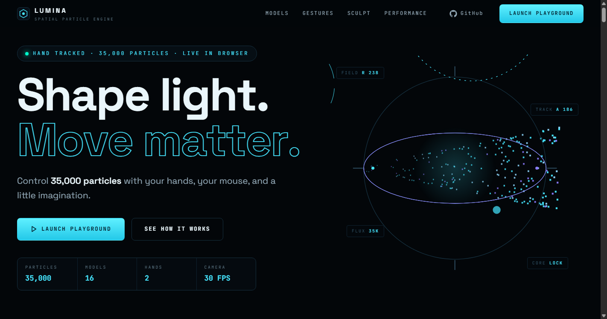
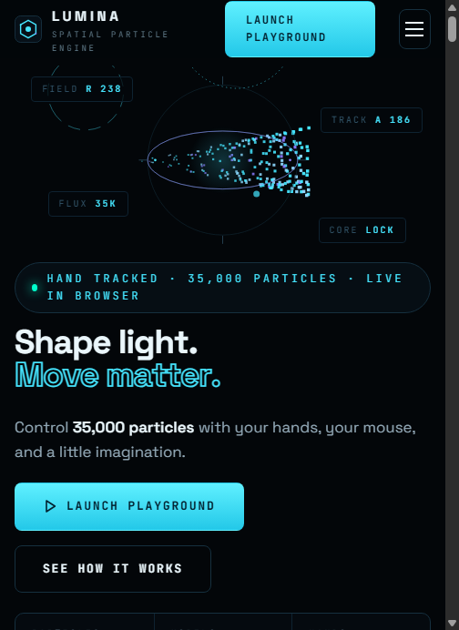
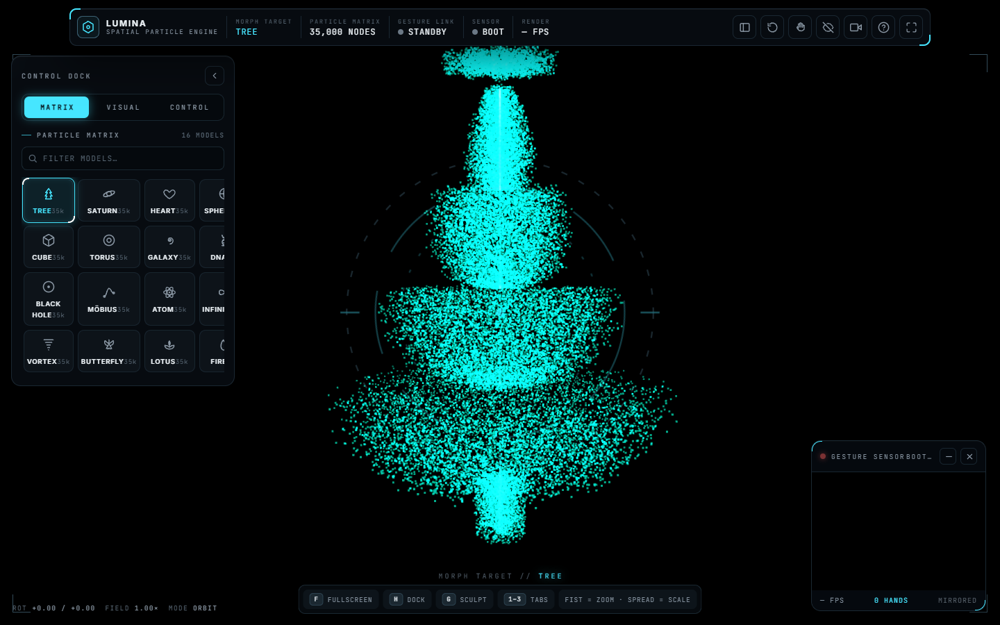
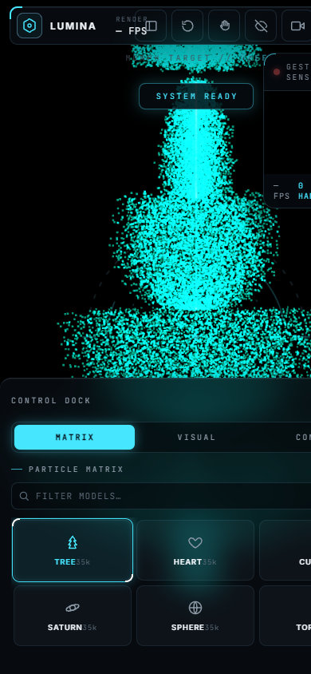

# Lumina — Spatial Particle Engine

Lumina is a hand-controlled 3D particle playground. It renders 35,000 live particles inside a futuristic command interface built with Three.js, MediaPipe Hands, and Anime.js, and ships as a fully static site.

## Live demo

**[Launch Lumina on Vercel](https://particle-interaction-pi.vercel.app/)**

Allow camera access to use gesture controls. A desktop browser is recommended for the complete experience.

## What's on this site

The two HTML pages now have different jobs:

| Page | Role |
| --- | --- |
| `index.html` | The **landing page**: a kinetic, scroll-driven introduction to Lumina with 10 animated sections, a model showcase, gesture and sculpt demonstrations, and CTAs that open the playground. Built with Anime.js v4. |
| `Particle_Interaction_Dual_Hands.html` | The **interactive playground**: the complete, self-contained particle application with hand tracking, mouse controls, sculpt tools, and visual settings. |

The landing page does not duplicate the playground. Every "Launch Playground" button and screenshot link on it opens `Particle_Interaction_Dual_Hands.html`, which remains unchanged and feature-complete.

## Preview

Landing page:



<p align="center">
  
</p>

Playground interface:

[](https://particle-interaction-pi.vercel.app/)

The desktop screenshot shows the playground's command interface with the model matrix dock, gesture sensor monitor, and telemetry rail. It is used both here and in the landing page's interface reveal section.

<p align="center">
  
</p>

The mobile screenshot demonstrates the responsive control dock, shown on the landing page without a device mockup.

## Playground highlights

- **35,000 real-time particles** with smooth transitions between models.
- **16 particle shapes:** Tree, Saturn, Heart, Sphere, Cube, Torus, Galaxy, DNA, Black Hole, Mobius Strip, Atom, Infinity Knot, Vortex Tunnel, Butterfly, Lotus, and Fire Tornado.
- **Dual-hand tracking** powered by MediaPipe Hands.
- **Gesture controls** for rotation, zooming, scaling, and particle grabbing.
- **Sculpt tools** with attract, repel, and drag modes.
- **Mouse controls** for orbiting, zooming, panning, and sculpting.
- **Visual controls** for particle color, size, morph speed, hand smoothing, and automatic rotation.
- **Futuristic command UI** with animated tabs, system telemetry, model filtering, a gesture-sensor monitor, and a built-in interaction guide.
- **Responsive layout** for desktop, tablet, and mobile screens.
- **Reduced-motion support** and keyboard-accessible controls.

## Particle models

| Classic models | Advanced models |
| --- | --- |
| Tree | Black Hole |
| Saturn | Mobius Strip |
| Heart | Atom |
| Sphere | Infinity Knot |
| Cube | Vortex Tunnel |
| Torus | Butterfly |
| Galaxy | Lotus |
| DNA | Fire Tornado |

Every model is generated mathematically in the browser. No external 3D model files are required.

## Gesture controls

| Gesture | Action |
| --- | --- |
| Move one open hand | Rotate the particle model |
| Make a fist and move toward or away from the camera | Zoom the model |
| Move two hands apart or together | Increase or decrease model scale |
| Pinch thumb and index finger while Sculpt Field is enabled | Grab and sculpt nearby particles |

Hand landmarks are smoothed across frames, while exponential averaging, dead zones, and fist hysteresis reduce jitter and accidental gesture changes.

## Mouse controls

| Input | Action |
| --- | --- |
| Left-drag | Orbit the camera |
| Scroll | Zoom |
| Right-drag | Pan |
| Left-drag with Sculpt Field enabled | Apply the selected sculpt tool |

## Keyboard shortcuts

Playground shortcuts:

| Key | Action |
| --- | --- |
| `F` | Toggle fullscreen |
| `H` | Collapse or expand the control dock |
| `C` | Pause or resume camera tracking |
| `V` | Hide or show the gesture-sensor monitor |
| `G` | Toggle Sculpt Field |
| `1` | Open the Matrix tab |
| `2` | Open the Visual tab |
| `3` | Open the Control tab |
| `Esc` | Close the system guide or cancel an active grab |

## Landing page

`index.html` is a kinetic, editorial launch page for the playground. It includes:

- A hero with a live particle-core canvas, radial measurement rings, and coordinated character entrances.
- A pinned particle manifesto (35,000 particles, 16 forms, 2 hands, zero limits) driven by scroll.
- A pinned horizontal showcase of all 16 models, replaced by a vertical card flow on small screens.
- A gesture laboratory, a sticky three-mode sculpt field, and an interactive visual calibration preview.
- Real code excerpts from the playground source, a dependency graph, and an honest performance field.
- An interface reveal built from the real desktop and mobile screenshots, and a final launch sequence.
- Progressive enhancement: the page stays fully readable, navigable, and clickable if the Anime.js CDN fails or if `prefers-reduced-motion` is set. Pinned scenes become normal static sections in both cases.

## Run locally

No build step or package installation is required. Serve the project through a local HTTP server so the browser can request camera permission.

```powershell
git clone https://github.com/smithplayz13-dev/Particle-Interaction.git
cd Particle-Interaction
python -m http.server 8000
```

Then open:

- Landing page: [http://127.0.0.1:8000/](http://127.0.0.1:8000/)
- Playground directly: [http://127.0.0.1:8000/Particle_Interaction_Dual_Hands.html](http://127.0.0.1:8000/Particle_Interaction_Dual_Hands.html)

> Camera access normally requires HTTPS or a trusted local origin such as `localhost` or `127.0.0.1`. Opening the HTML file directly with `file://` may prevent gesture tracking.

## Tech stack

Playground (`Particle_Interaction_Dual_Hands.html`):

- [Three.js](https://threejs.org/) r128 and OrbitControls for 3D rendering and camera movement.
- [MediaPipe Hands](https://ai.google.dev/edge/mediapipe/solutions/vision/hand_landmarker) and CameraUtils for hand landmark tracking.
- [Anime.js](https://animejs.com/) 3.2.2 for interface transitions and the boot sequence.

Landing page (`index.html`):

- [Anime.js](https://animejs.com/) v4 (pinned `4.5.0` via jsDelivr) for scroll choreography, timelines, staggering, SVG drawing, motion paths, and draggable interactions. The v3 copy used by the playground is untouched.

Both pages are vanilla HTML, CSS, and JavaScript with no build system. Libraries and fonts load from CDNs, so an internet connection is needed when running the project locally.

## Project structure

```text
.
├── index.html                           # Kinetic landing page (Anime.js v4)
├── Particle_Interaction_Dual_Hands.html # Interactive playground (self-contained)
├── favicon.ico
├── favicon.svg
├── favicon.png
├── favicon-192.png
├── favicon-512.png
├── docs/
│   └── screenshots/                     # Desktop and mobile interface previews
└── README.md
```

The two HTML files are separate documents with separate purposes and are not synchronized. The playground is the complete application; the landing page links to it.

## Deployment

The project is deployed as a static site on Vercel with no build command:

**https://particle-interaction-pi.vercel.app/**

The Vercel root serves the landing page. Pushing changes to the connected production branch triggers a new deployment.

## Performance notes

- Particle target positions are generated once during initialization.
- The renderer caps device pixel ratio to reduce GPU load on high-density screens.
- Camera processing is throttled to a target of 30 FPS.
- Interface state polling is kept outside the Three.js render loop.
- UI animation uses transform and opacity where possible and respects `prefers-reduced-motion`.
- On the landing page, canvas fields cap their own pixel ratio, pause when off-screen or when the tab is hidden, and below-the-fold scenes initialize only when needed.

## License

No license has been added yet. Until one is provided, the source remains under the repository owner's default copyright.
